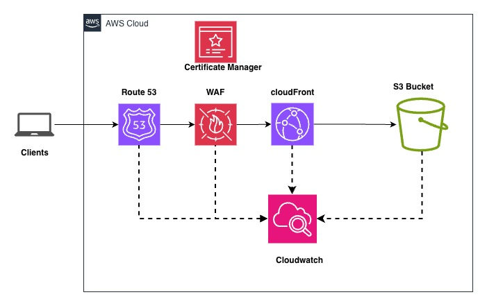

# Static Portfolio Website on AWS (S3 + CloudFront)

This repository contains a static portfolio website built using the Tooplate free template and deployed on AWS using Amazon S3 and Amazon CloudFront. The infrastructure is provisioned with Terraform and delivered via a GitHub Actions CI/CD pipeline that authenticates to AWS using OpenID Connect (OIDC) for short‑lived credentials.


## Overview
- Amazon S3 stores the site’s static assets (HTML, CSS, JS, images) with durability and high availability.
- Amazon CloudFront is configured with the S3 bucket as its origin, providing a global CDN for low‑latency content delivery.
- Public access to the S3 bucket is fully blocked; CloudFront uses an Origin Access Control (OAC) to reach the bucket securely.
- S3 Server‑Side Encryption (SSE) is enabled to protect data at rest, adding defense‑in‑depth to the architecture.
- Terraform manages the AWS resources and uses an S3 remote backend for state.
- GitHub Actions provides CI/CD, assuming an AWS IAM role via OIDC (no long‑lived AWS keys required).


## AWS Architecture
- S3 bucket (origin)
  - Static hosting of the portfolio files.
  - Public access blocked.
  - Server‑Side Encryption (SSE) enabled.
- CloudFront distribution
  - Origin: The S3 bucket via OAC.
  - Default root object: index.html.
  - Global edge network for high performance and low latency.

### Architectural Diagram





## Infrastructure as Code (Terraform)
- Provider: AWS (region is configurable via variable). The current config uses us‑east‑2.
- Remote backend: Amazon S3.
  - Example (see terraform/main.tf):
    - bucket: klaudtech-state
    - key: portfolio-website/terraform.tfstate
    - region: us-east-2
- Core resources:
  - S3 bucket for static site content.
  - CloudFront distribution with OAC pointing to the S3 origin.

Edit terraform/variables.tf to tailor names/regions as needed and update terraform/main.tf if you change backend configuration.


## CI/CD with GitHub Actions (OIDC to AWS)
- Workflow: .github/workflows/on_push.yaml (runs on pushes to main)
- Jobs:
  - terraform: Initializes, validates, and applies Terraform; then outputs S3 bucket name and CloudFront distribution ID.
  - deploy: Syncs the portfolio folder to S3 and invalidates the CloudFront cache.
- Authentication: Uses aws-actions/configure-aws-credentials with a role-to-assume sourced from the AWS_IAM_ROLE_ARN GitHub secret. OIDC provides short‑lived credentials at runtime.

Required GitHub repository secret:
- AWS_IAM_ROLE_ARN: ARN of the IAM role that the workflow assumes.


## How to Deploy
1) Clone the repository
- ```git clone git@github.com:emchegep/A-static-portfolio-website.git```
- ```cd Static-Portfolio-Website```

2) Configure the Terraform backend (S3)
- Create or choose an S3 bucket for Terraform state (e.g., klaudtech-state in us-east-2).
- Ensure appropriate IAM permissions for state access and locking.
- Update terraform/main.tf with your backend bucket/key/region if different.

3) Configure OpenID Connect (OIDC) for GitHub Actions
- In AWS IAM, create an Identity provider for GitHub (if not already present):
  - Provider URL: https://token.actions.githubusercontent.com
  - Audience: sts.amazonaws.com
- Create an IAM role for GitHub Actions to assume:
  - Trust policy: Allow the GitHub OIDC provider to assume the role.
  - Condition(s): Restrict by your GitHub org/repo and branch as appropriate, for example using token claims like repo:<org>/<repo>:ref:refs/heads/main.
  - Permissions policy: Allow required actions used by Terraform and deployment (e.g., s3, cloudfront, iam, etc., as appropriate to your setup).
- In the GitHub repository settings, add the secret AWS_IAM_ROLE_ARN with the role’s ARN.

4) Create the AWS resources with Terraform
- Option A (via GitHub Actions): Push to the main branch to trigger the pipeline, which runs terraform apply and deploys the site automatically.
- Option B (locally):
  - Ensure AWS credentials with sufficient permissions are available (e.g., via AWS SSO or environment variables).
```
    cd terraform
    terraform init
    terraform validate
    terraform apply -auto-approve
 ```

5) Deploy/Update the website content
- The CI job syncs portfolio/ to the provisioned S3 bucket and invalidates CloudFront.
- You can also deploy manually:
```
aws s3 sync portfolio s3://<your-bucket-name>
aws cloudfront create-invalidation --distribution-id <dist-id> --paths "/*"
```


## Repository Layout
- portfolio/ … Static website files (Tooplate template)
- terraform/ … Terraform IaC for S3, CloudFront, backend configuration, variables, and outputs
- .github/workflows/on_push.yaml … CI/CD workflow (Terraform + deploy)


## Security Notes
- Public access to the S3 bucket is blocked; CloudFront uses Origin Access Control to reach the bucket.
- S3 Server‑Side Encryption (SSE) is enabled to protect data at rest.
- GitHub Actions authenticates to AWS using OIDC to avoid long‑lived AWS access keys in secrets.


## Areas for Improvement
- Add a custom domain to the CloudFront distribution.
- Provision an AWS Certificate Manager (ACM) certificate and attach it to the CloudFront distribution for the custom domain (enable HTTPS with your domain).


## Troubleshooting
- Terraform state/backend: Ensure the specified backend bucket/key/region exist and that your role has s3 permissions for state access.
- OIDC role assumption errors: Verify the trust policy conditions (sub/repo/branch) match your repository and workflow. Confirm AWS_IAM_ROLE_ARN is set in repository secrets.
- Access denied from S3: Confirm public access is blocked and the CloudFront OAC policy allows access from the distribution.
- Stale content: Run a CloudFront invalidation after updates (the workflow already does this on deploy).


## License / Template Attribution
- Website template: Tooplate (free template). See portfolio/ABOUT THIS TEMPLATE.txt for attribution details.
